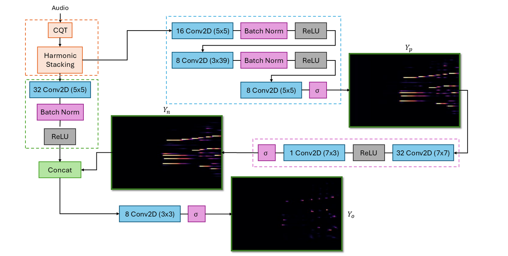
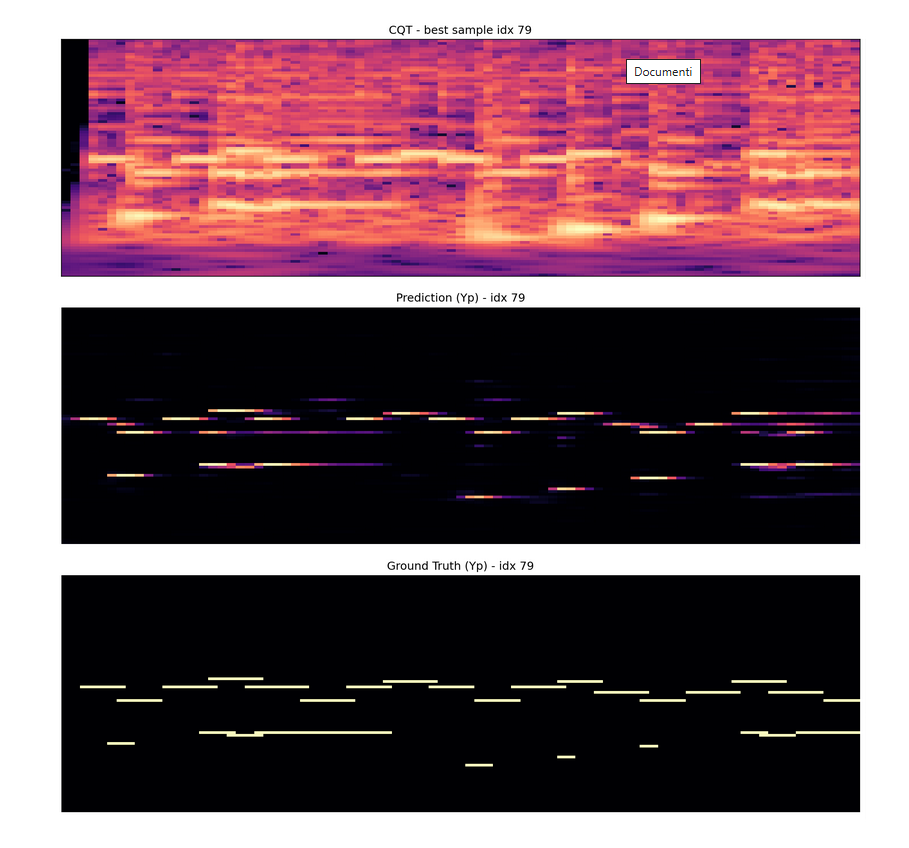

# MLVM-proj

## Project Structure

```
MLVM-proj/
│
├── main.py
├── README.md
├── requirements.txt
├── settings.py
│
├── audio-fonts/
│
├── dataloader/
│   ├── dataset_folder_management.py
│   ├── dataset.py
│   ├── MidiToWav.py
│   ├── Song.py
│   ├── split.py
│
├── eval_plots/
│   ├── best__*.png
│   └── worst__*.png
│
├── model/
│   ├── HarmonicNet.py
│   ├── model.py
│   ├── postprocessing.py
│   └── preprocessing.py
│
├── model_rnn/
│   └── model.py
│
├── model_saves/
│   ├── best_model_before_retrain.pth
│   └── best_model.pth
│
├── resources/
├── evaluate.py
│   ├── audios
│   ├── eval_plots
│   ├── original_midi
│   ├── predicted_midi
│   └── setup.txt
│
└── train/
    ├── evaluate.py
    ├── extremes.py
    ├── inference.py
    ├── losses.py
    ├── quality_index.py
    ├── rnn_losses.py
    ├── test.py
    ├── train.py
    └── utils.py
```

## Main Folders and Files Description

- `main.py`: Entry point of the project; can be used to run or test main functionalities.
- `dataloader`: Contains scripts for dataset management, MIDI/audio conversion, and data splitting.
- `eval_plots`: Stores evaluation plots (best/worst predictions) generated during experiments.
- `model`: Implements the main neural network architectures and preprocessing/postprocessing utilities.
- `model_rnn`: Contains RNN-based model implementation.
- `model_saves`: Stores saved model checkpoints and weights.
- `resources`: Stores the audios and auxiliary materials used for testing the trained model not in the dataset.
- `train`: Training, evaluation, inference, and utility scripts for model development and testing.

## Setup

1. **(Optional) Create and activate a virtual environment:**

   ```powershell
   python -m venv .venv
   .\.venv\Scripts\Activate.ps1	# Windows
   source .venv\bin\activate		# Linux
   ```

2. **Install dependencies:**

   ```powershell
   pip install -r requirements.txt
   ```

3. **Download and place SoundFont files:**

   The `audio-fonts` folder is not included in the repository. Download the required `.sf2` files separately and place them in the `audio-fonts/` folder. It is possible to find them in the materials folder that we have loaded together with the report. In particular, you will find:
   - `Piano.sf2`
   - `Guitar.sf2`

4. **Run the code:**
   ```powershell
   python main.py [<CLI_COMMAND>]
   ```

## CLI Commands

- **Help command:**

  ```powershell
  python main.py [<CLI_COMMAND>] -h
  ```

  or

  ```powershell
  python main.py [<CLI_COMMAND>] --help
  ```

- **Train the model:**

  ```powershell
  python main.py train [-h]
  ```

- **Transform audio into MIDI with our model:**

  ```powershell
  python main.py process [-h] -i INPUT [-o OUTPUT] [-m {RNN,CNN}] [-p MODEL_PATH]
  ```

  where
  - `INPUT` is the input audio file path
  - `OUTPUT` is the output MIDI path (defaults to the same name of the input, with `.midi` extension)
  - `CNN` or `RNN` is the model type to use (defaults to `settings.py`)
  - `MODEL_PATH` is the path to the desired trained model (defaults to `settings.py`)

- **Render an existing MIDI file into audio:**

  ```powershell
  python main.py convert [-h] [-o OUTPUT] [-s SOUND_FONT] midi_file
  ```

  where
  - `OUTPUT` is the output audio path (defaults to the same name of the input, with `.midi` extension)
  - `SOUND_FONT` is the path th the sound font to use (defaults to `settings.py`)

- **Evaluate the model on the test set with precision/recall/F1:**

  ```powershell
  python main.py test [-h] [-n NUM_TESTS] [-d SAVE_DIR] [-v] [-m {RNN,CNN}] [-p MODEL_PATH]
  ```

  where
  - `NUM_TESTS` is the number of text examples to run (all if omitted or too large)
  - `SAVE_DIR` is the directory where to save ground truth and outputs (won't save anything if omitted). Its current content will be erased, if it exists
  - `-v`/`--verbose` prints stats for each test individually (on top of the cumulative stats)
  - `CNN` or `RNN` is the model type to use (defaults to `settings.py`)
  - `MODEL_PATH` is the path to the desired trained model (defaults to `settings.py`)


## Model

## Results Example
